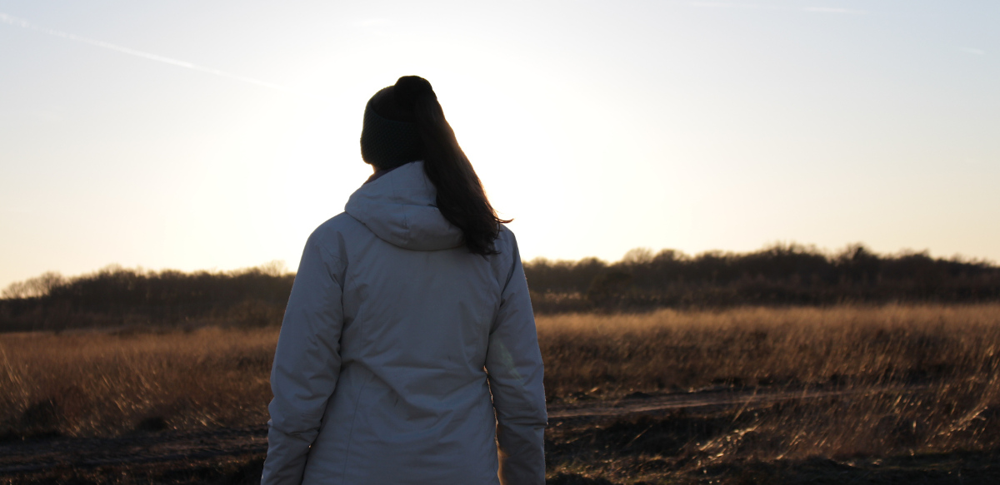

+++
featured_image = "outvontuur.png"
body_classes = "avenir bg-near-white outvontuur-home"
+++

Ik vind het erg leuk om te schrijven over mijn passie kamperen. Op de Outvontuur
blog kom je dan ook artikelen tegen over de verschillende aspecten van kamperen.
Zo vind je er reisverslagen over bijvoorbeeld roadtrips en wandelingen, maar ook
van weekendtrips in Nederland. Hiermee hoop ik je te inspireren om ook meer
avonturen te beleven! Daarnaast vind ik het leuk om reviews te schrijven over
toffe gear (uitrusting) en boeken. Zo heb jij wat meer informatie voordat je
iets nieuws aanschaft. Ook schrijf ik regelmatig een review over de campings die
ik bezocht heb. Stiekem heb ik als doel om alle natuurkampeerterreinen in
Nederland te bezoeken.

Op de Outvontuur blog vind je ook een categorie die Outdoorlicious heet. Hier
wil ik mijn enthousiasme delen voor lekkere recepten tijdens het kamperen. Van
kampvuur gerechten tot hike maaltijden. Daarnaast ben ik iemand die heel
enthousiast in een onderwerp kan duiken en hier een soort hyperfocus in heeft.
De informatie die ik hiermee verzamel, deel ik onder Ontdekkingslust, waar je
inspiratie en tips kunt vinden.

Ik hoop dat je geïnspireerd raakt van de artikelen die je op de Outvontuur blog
kunt vinden. Mocht je informatie over een specifiek onderwerp willen of mis je
iets op de blog, neem dan contact met mij op. Ik kan niet persoonlijk op elke
vraag antwoorden, maar als het iets is waar meer mensen in geïnteresseerd zijn
dan behandel ik het graag op de Outvontuur blog.

Hieronder vind je een overzicht van de meest recente artikelen:
