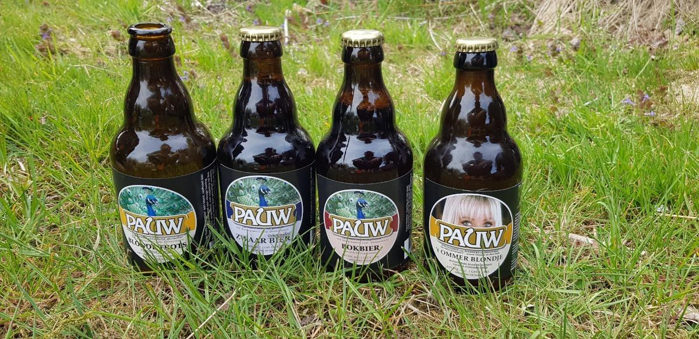
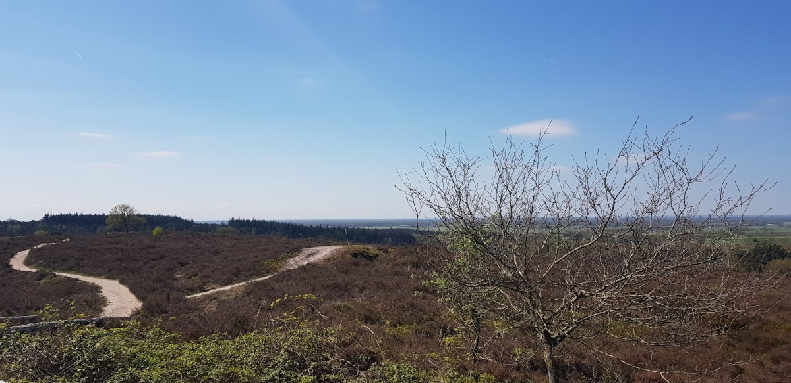
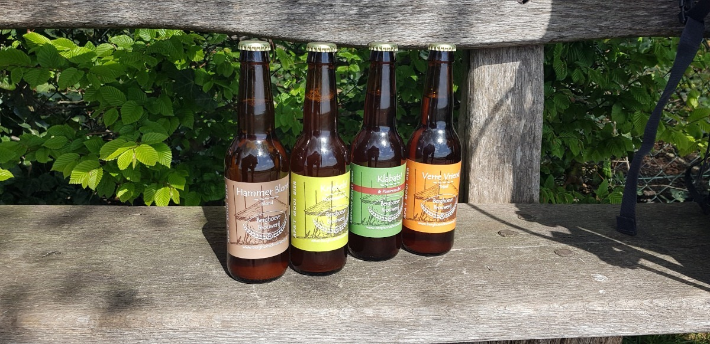

+++
date = '2026-08-21T17:30:29+02:00'
draft = true
title = 'Bier & Bes wandelroute'
description = "Verslag van onze wandeling over de Bier & Bes route"
featured_image = 'meer-pad.jpg'
categories = ['Reisverslagen']
tags = ["Wandelen", "Ommen", "Overijssel", "Bier & Bes"]
+++

´Heb jij nog een plekje in je tas?´ ´Ik heb hier nog wel een gaatje.´ Na ons
bezoek aan de ijsboerderij en Bierbrouwerij De Pauw konden we het niet laten om
een streek biertje te kopen. Onze tassen zitten vol met onze kampeeruitrusting
en eten, maar voor een streek biertje maken we altijd plek. Dit biertje zal
extra lekker smaken nadat we er de laatste kilometers tot de camping ermee
gewandeld hebben, het heet niet voor niks de Bier & Bes wandelroute.

In april 2022 liepen we de Bier & Bes wandelroute, deze is gemaakt door
[landschap Overijssel](https://landschapoverijssel.nl/). De route is niet
bewegwijzerd, maar je kunt informatie en het GPX-bestand verkrijgen op hun
website. Deze wandelroute loopt door het Vechtdal / Reestdal, wat een mooi en
divers gebied is. Onze aandacht was getrokken door de naam van de route, welke
beloofd dat we langs bierbrouwerijen komen en een streek waar bessen groeien
bezoeken. Voor de bessen waren we in april helaas niet in het juiste seizoen,
maar de brouwerijen konden we wel bezoeken.

De Bier & Bes route bestaat officieel uit twee etappes, de
[eerste](https://landschapoverijssel.nl/routes/bier-bes-dag-1) van
Vroomshoop naar Ommen van 17 km en de
[tweede](https://landschapoverijssel.nl/routes/bier-bes-dag-2) loopt van Ommen
naar Mariënberg en is 19 km. Wij liepen een wandeltocht gebaseerd op deze route.
Deze hebben we met bepakking gelopen waarbij we op campings sliepen, daarom
hebben we de route verdeeld in vier etappes. Daarnaast maakte we een extra lus
over Archemerberg. De exacte route die we liepen, ook van de andere dagen, kun
je onderaan dit artikel vinden. In dit artikel neem ik je mee met ons op
avontuur en vertel ik je of deze route de moeite waard is.

### Dag 1: 12.6 km

Geheel volgens de instructies van de route zijn we in Vroomshoop begonnen, waar
we met de trein aan kwamen. Het dorp ben je snel uit. Daarna loop je ongeveer 5
km tussen de bomen kom je uit bij een opener landschap met landbouw en weides.
Dit is ook het moment dat de route langs [Berghoeve
Brouwerij](https://www.berghoevebrouwerij.nl/) loopt. De brouwerij was tot onze
teleurstelling niet open, maar bij nadere inspectie liep er wel iemand over het
terrein die ons een paar biertjes wou verkopen. Ook de tweede bierbrouwerij die
op de Bier & Bes route ligt, namelijk [Bierbrouwerij De
Pauw](https://www.pauwbier.nl/), kwamen we tegen in deze eerste etappe. Naast de
brouwerij zit op dit terrein ook [IJsboerderij De
Meulenhorst](http://www.meulenhorst.nl/), welke erg lekkere ijsjes verkoopt. Via
een mooi doorsteekje vanaf de boerderij hebben wij de Bier & Bes route verlaten
om naar [camping Noord Meer](https://noordmeer.nl/) te lopen, waar we onze
eerste nacht doorbrachten.

### Dag 2: 12,5 km

Op de tweede dag maakte we de keuze om van de Bier & Bes route af te wijken en
over de Archemerberg te wandelen. Het was zonnig weer en we hadden een prachtig
uitzicht vanaf de ´berg´, welke zelf begroeid is met heide. Op de Archemerberg
stond een stevige wind. Daarom werd de pauze nog even uitgesteld totdat we iets
beschutter konden zitten. Een traditie tijdens het wandelen die wij graag in ere
houden is iets bakken voor de lunch. Deze keer kozen we voor vega hamburgers
waarmee we menig voorbijganger jaloers maakte. De route naar Ommen vervolgde
zicht via de Besthmenermolen bij het [Bezoekerscentrum
Ommen](https://bezoekerscentrumommen.nl/). Onze tent hebben we opgezet bij
[camping Anna's Hoeve](https://www.camping-annahoeve.nl/). Door de ligging langs
de Vecht is dit een gewilde camping voor grote caravans en daardoor minder
gezellig wanneer je kampeert met een trekkerstent.

Na de 12.5 km die we vandaag al in de benen hadden moest er nog boodschappen
worden gedaan in Ommen. We liepen hier zonder onze bepakking heen, en beloonde
onszelf met een ijsje. In de supermarkt kwamen we lokale biertjes tegen van de
[Vechtdal Brouwerij](https://www.vechtdalbrouwerij.nl/), waardoor we in het
thema van de Bier & Bes route bleven.

### Dag 3: 15.2 km

Op deze derde dag liepen we eerst weer naar het centrum van Ommen voor een
laatste boodschapje, want we zouden geen winkel meer tegen komen vandaag. Daarna
kwam er een vrij saai stukje langs de weg voordat we het bos in trokken. De
bossen bij Ommen zijn prachtig. Voor de variatie kun je een klein stukje om
lopen via de
[Sahara](https://www.vechtdaloverijssel.nl/natuurgebieden/sahara-ommen/), bij
deze zandverstuiving hebben wij een mooi plekje gezocht om te lunchen. De tocht
vervolgde zich naar de Stuw bij Junne. Het mooie van dit deel van de wandelroute
is dat je heel natuurlijk loopt en bijna niks tegen komt. Uiteindelijk eindigde
wij bij [camping Huttopia de
Roos](https://europe.huttopia.com/nl/site/de-roos/), de Bier & Bes wandelroute
loopt over het terrein van deze camping. Deze camping is veel groter dan dat ik
normaal zou uitkiezen, maar het was verrassend gemoedelijk met voldoende privacy
en verschillende veldjes.

### Dag 4: 5.7 km

De laatste etappe naar Mariënberg was een korte etappe, maar wel een erg mooie.
Je loopt hier door een heuvelachtig gebied waar ook bosbessen groeien. De
bosbessen planten stonden op het moment waarop wij hier liepen in bloei. Dit
stukje doet een beetje on-Nederlands aan door de hoogte verschillen en is
daardoor een aanrader. Nadat we langs de zandverstuiving bij Beerze liepen
kwamen we aan in Mariënberg waardoor er toch echt een einde aan deze mooie Bier
& Bes wandelroute kwam.

## Tot slot

De variatie die wij liepen op de Bier & Bes wandelroute was in totaal ongeveer
46 km verspreid over 4 dagen. De route is erg gevarieerd je loopt door en langs
bos, weides, heide en zandverstuivingen. Sommige stukjes gaven mij echt een
vakantie gevoel, omdat ze niet op het standaard Nederlandse landschap lijken.
Alle campings die wij bezochten waren goed te bereiken, maar er zijn ook nog
andere campings langs de route die wij niet bezocht hebben. De route die wij
hebben gevolgd heb ik bijgehouden in Gaia GPS, via de volgende links kun je de
GPX van de verschillende dagen downloaden:

- [Route dag 1](https://www.gaiagps.com/map/?loc=12.5/6.4847/52.4678&pubLink=OGWyt63t4xP5INsgYu42MWEd&trackId=d726660fc9ed4b3fdd23d6bfefeae45fd945ef25)
- [Route dag 2](https://www.gaiagps.com/map/?loc=14.4/6.4103/52.4891&pubLink=1cgfR7Iz9DmMay3LxezUgO5r&trackId=f690c4faff38a3f3954be28c526b0880305db4b1)
- [Route dag 3](https://www.gaiagps.com/map/?loc=12.5/6.4316/52.5177&pubLink=IEcMUC9P6DDu6gemHSkWYgL0&trackId=c410cdc49c73a7a686a8a479f7e435adf8050e3c)
- [Route dag 4](https://www.gaiagps.com/map/?loc=12.5/6.4317/52.5178&pubLink=aST5NPE0xoOX3KPuU8nSFwKB&trackId=2affbea7cf72f42af570abe329075401ed566f7c)

Mocht je zelf deze route gelopen hebben of gaan lopen laat mij dit dan vooral
weten via de reacties. Ik vind het leuk om jouw ervaringen te horen. Kijk bij
[wandelroutes](https://outvontuur.nl/category/reisverslagen/wandelen/) op mijn
blog voor meer route verslagen en inspiratie.

Alternatieve titels: Vier dagen wandelen rondom Ommen, Routeverslag: Bier & Bes.
